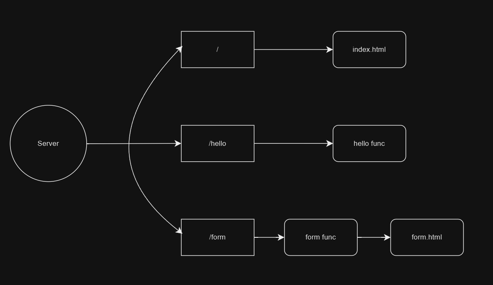

# GoLangProject-WebServer-SmallProject-
This project is a minimal web server application written in Go. It showcases handling of HTTP routes, serving static assets, and processing form submissions. Ideal for practice, learning, or extending into a larger web application.
# GoLangProject (WebServer-SmallProject)

A simple HTTP web server built using **Go (Golang)**.  
It serves static files, responds to `/hello`, and handles form submissions via `/form`.
## Project Workflow

---

## Features

- Serves static files from `./static`
- `/hello` endpoint (GET)
- `/form` endpoint (POST)
- Runs on port 8080
- Basic error handling

---

## Project Structure
GoLangProject(WebServer-SmallProject)/
│
├── main.go
├── static/index.html,form.html
└── workflow.png

---

## How to Run

1. Make sure Go is installed:
2.Go into project Directory use: go build(for exe file in windows)
3. go run main.go (To run the file)

Visit http://localhost:8080 in your browser.

Endpoints
1. Static Files

http://localhost:8080/ — serves files from static/

2. Hello

GET /hello
Response:
hello! wasp

3. Form

POST /form with fields name and address
POST request sucess
Name= John
Address= USA
